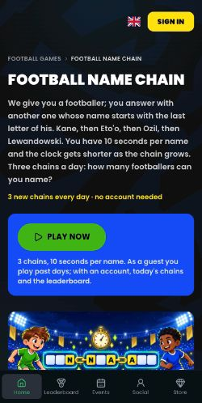

# QuizBall word game mobile performance

Mobile is improved but **not fixed**. The latest local pass, on 10 October, reduced navigation downloads by 32.5% on Turkish Played for Both and 37.3% on English Football Name Chain against a matched baseline. Default simulated mobile performance medians are 83 and 79, with LCP still 4.42 s and 5.44 s. Desktop medians are 98 on both pages. All 2,273 tests passed, with 8 skipped, and the production build passed. Nothing has been pushed or deployed. The earlier passes and their different measurement methods are retained below; the latest evidence is in the 10 October section.

## Causes and implemented fixes

| Cause | Fix |
| --- | --- |
| The main illustration used lazy loading and a generic image size hint. | Load the hero eagerly with high fetch priority and a size hint matching its actual column. Keep related illustrations lazy. |
| The word game leaderboards imported their game engines and downloaded large avatar artwork before the visitor needed them. | Load the existing leaderboard and its scripts when its container enters view. Keep its existing data, language, account handling and daily calendar. |
| Launcher controls imported the full SEO catalogue. A server dynamic reference also brought unrelated FIFA artwork data into the loading path. | Extract the small launcher constants and defer the decorative FIFA artwork module until a FIFA tile mounts. |
| Related tiles requested images sized for a full mobile screen, despite their two or three column layout. | Supply image sizes matching the tile grid. |
| Links automatically fetched other game and sign in routes. | Disable prefetching on public game cards and account links; preserve destinations, click tracking and return paths. Navigating still fetches the destination normally. |
| The theme initialization script was blocked by the existing Content Security Policy. | Pass the request nonce to the theme provider. Do not weaken the policy. |
| White text on the green launch button and translucent text on blue cards failed contrast checks. | Use black launch text and solid white card descriptions. |

These image changes follow [Google's LCP guidance](https://web.dev/articles/optimize-lcp): the largest visible image should not be lazy loaded and should receive appropriate loading priority.

## Matched mobile measurements

Both versions were built from production commit `70a567a9`, served sequentially on the same `localhost:3000` origin and tested against the same production public API. The after version adds only this branch's changes. Public authentication configuration was supplied for both builds; local analytics had no production PostHog key. Tests used Chrome 154 and the same Lighthouse configuration for each before and after pair.

The following are medians of three runs per version using Lighthouse 13.0.1 with direct DevTools network and CPU throttling. MB means decimal megabytes. Downloads cover the audit navigation, not an entire gameplay session.

| Page | Performance before and after | LCP before and after | Blocking time before and after | Download before and after |
| --- | --- | --- | --- | --- |
| `/tr/futbol-oyunlari/ortak-futbolcu-oyunu` | 82 → 96 | 4.38 s → 2.25 s | 144 ms → 107 ms | 2.11 MB → 1.27 MB |
| `/en/football-games/football-name-chain` | 83 → 96 | 4.03 s → 2.34 s | 160 ms → 104 ms | 1.83 MB → 1.26 MB |

Accessibility improved from 96 to 100 and best practices from 92 to 100. The before runs recorded the blocked theme script; the after runs recorded no browser console errors. Initial-load layout shift stayed below 0.004 in these runs. This does not measure shifts during a whole scrolling or gameplay session.

### Default simulated Lighthouse remains below target

Lighthouse 13.5.0, the current registry release at verification time, was also tested with its default simulated mobile settings on the Turkish shared player page. One matched run per version returned performance 74 → 82, LCP 7.28 s → 4.57 s, accessibility 96 → 100 and best practices 92 → 100. A single run is not a stable benchmark.

After rebasing and rebuilding on `d629543e`, three more default simulated runs per representative page returned the following. These are final local after measurements, not a matched before and after comparison on that newer base.

| Final page | Performance median and range | LCP median | Blocking time median |
| --- | --- | --- | --- |
| Turkish shared player | 86, range 84–94 | 3.85 s | 144 ms |
| English Name Chain | 81, range 80–83 | 4.84 s | 73 ms |

Accessibility and best practices remained 100, with no console errors. The isolated score of 94 is not a consistent 90+ pass.

Earlier three-run simulated tests with Lighthouse 13.0.1 returned median performance 76 → 76 on the Turkish shared player page and 78 → 75 on English Name Chain. They did not establish a performance score improvement in that mode. After single-run simulated checks across all eight language variants ranged from 68 to 84, with accessibility and best practices both 100.

Direct throttling and simulated throttling are different measurement methods; the 96 score is not a prediction that PageSpeed Insights will show 96. [Google's Lighthouse documentation](https://github.com/GoogleChrome/lighthouse/blob/main/docs/throttling.md) explains the difference. The remaining initial payload includes shared application, authentication, analytics and all four language dictionaries. Further splitting needs regression review across account and language navigation, not removal of those features just to change a score.

## Verification

- 94 targeted regression tests passed in 17 files, including hero loading, deferred boards, all four locales, link tracking, signup return paths, runtime constants and the theme nonce.
- Changed TypeScript and TSX files passed lint; the standalone type check and production build passed. The build generated 277 pages.
- All eight local game URLs returned HTTP 200, one H1, the expected production canonical, high priority hero markup and no inline script missing its nonce. Local pages deliberately remain noindex; their local SEO score is not a production SEO assessment.
- Chrome checked English Name Chain and Turkish shared player launch and exit on desktop and at 390 by 844 pixels. Both loaded their localized guest intro without an account. Exit cleared the play query and closed the dialog. The deferred leaderboard appeared after entering view. The browser recorded no errors in these checks.
- No round was started or completed for verification. Authenticated gameplay, signup completion, every game mode and full-session layout stability are not certified by these checks.

## Release and remaining verification

The implementation is in the isolated `codex/word-games-mobile-performance` branch, rebased onto production `d629543e` after the Georgian naming update shipped during verification. Matched before and after measurements use the earlier `70a567a9` baseline; final rebased simulated checks are identified separately above. All 94 targeted tests and the production build passed again on the rebased version, and all eight HTML checks passed with the new Georgian name preserved. The original working checkout and its unrelated edits were left untouched. There are no database migrations, URL changes, indexing submissions or security policy relaxations in this fix.

Next gate: review and deploy through staging, repeat the public PageSpeed mobile tests on all eight pages, and check guest launch, leaderboard loading and account navigation before promotion. Production performance and real user Core Web Vitals remain unverified for this change. The previous origin level field assessment cannot be treated as page specific data or an immediate before and after test.

## Further optimization pass, 9 October

The React performance guidelines were used to separate code by when the visitor needs it. The reporting guidance was used to retain the historical measurements above and distinguish the new local evidence from production results.

| Remaining cost | Additional change |
| --- | --- |
| Opening the language selector's module imported the whole public game catalogue on every visit. | Load the translated route resolver when the language menu opens. Preserve translated slugs, query parameters, menu roles and the existing campaign fallback to English for Turkish. |
| Displaying a ranking still imported a playable word-game engine. | Extract the ranking, sign-in link and small game definitions into standalone modules. The page ranking no longer imports either engine or its animation UI. |
| Tiny avatar overlays downloaded their original 600px artwork. | Request responsive first-party thumbnails with the existing optimizer. Keep percentage positioning, hair masks, tints, custom CDN resolvers and un-sized preview consumers. |
| Guest navigation fetched account-only destinations in the background. | Disable navigation prefetch for loading and anonymous visitors; retain member prefetch, destinations, return paths and the sign-in guard. |
| Guest pages imported member reward, notification and friend invitation UI. | Defer those components until authenticated. Keep their underlying stores, receipt acknowledgements, polling, invitation actions and analytics unchanged. |

### Additional verification

- 206 targeted tests passed across 27 files in a sequential run. Coverage includes the earlier marketing and SEO tests, translated word-game and campaign links, avatar geometry and CDN compatibility, guest/member navigation, locale context, and reward receipt/polling behavior.
- A prior run concurrent with the production build had six reward animation timing failures. All 23 reward-flow tests passed in isolation, then the entire selected suite passed sequentially. No assertion or animation timeout was weakened to make these pass.
- All changed TypeScript/TSX files passed lint. The final production build, including TypeScript checking, passed and generated 277 pages.
- All eight local page URLs returned 200, one H1, the expected production canonical, one eager/high-priority hero and no inline script missing its nonce.
- Chrome verified deferred ranking appearance, language navigation from Turkish to the corresponding Spanish page, and Spanish/English guest intro opening and exit. A 390 by 844 mobile visual check showed the avatar layers and ranking rows rendering correctly without horizontal overflow. Visible avatar overlays used successful 32px/48px image requests instead of the raw originals.
- After the final member-only loading change, clicking Social as a guest still opened the sign-in dialog on the current public page. No account was created and no gameplay round was started.

These checks do not certify authenticated notification delivery, invitation acceptance, every avatar combination, completed signup, full gameplay sessions or production performance. Local analytics did not use a production PostHog key. One Chrome extension error was excluded from the application-error observations.

### Measurement limitations and remaining work

The default simulated mobile test still varies significantly between runs. Intermediate second-pass runs returned 74–80 before guest navigation prefetch was removed. After removing that prefetch and deferring reward UI, three runs per page returned median 79 for both representative pages, with downloads of 1.197 MB and 1.186 MB. Those runs did not establish a score improvement over the first-pass medians above. Final member-notification/invitation measurements are recorded below separately.

The remaining shared payload includes authentication, analytics, all four language dictionaries and some animation code used by shared loading UI. Splitting locale dictionaries and more of the application provider tree is a larger follow-up requiring account/language and event-delivery regression checks. Render-blocking global CSS and fonts remain visible in the audits. Nothing in this pass removes tracking, weakens authentication, changes gameplay rules or changes indexing/URLs.

### Final second-pass simulated mobile measurements

Lighthouse 13.5.0 and Chrome 154; medians of three runs per page on the final local production build. The mobile preset uses default simulated throttling. These are after measurements, not a new tightly matched baseline test.

| Page | Performance median and range | LCP median | Blocking time median | Download median |
| --- | --- | --- | --- | --- |
| Turkish shared player | 80, range 79–90 | 5.03 s | 124 ms | 1.193 MB |
| English Name Chain | 80, range 76–84 | 4.98 s | 95 ms | 1.182 MB |

Downloads were about 73 KB lower per representative page than the first-pass rebased measurements, roughly 6%. No account-only route prefetches appeared in any of these six navigations. Accessibility and best practices were 100 in all six runs; the console-error audit found none. Initial-load CLS stayed below 0.003.

The default simulated performance score did **not** improve overall: the earlier first-pass medians were 86 and 81. Blocking time decreased on the Turkish page but increased on English Name Chain. The payload reduction is verified; a stable mobile score or LCP improvement from this extra pass is not. The single Turkish score of 90 is not a consistent 90+ pass.

### Final second-pass desktop measurements

Same build, Lighthouse 13.5.0 desktop preset; medians of three runs per page. These are local after measurements, not proof of a desktop improvement over a matched baseline.

| Page | Performance median and range | LCP median | Blocking time median |
| --- | --- | --- | --- |
| Turkish shared player | 95, range 95–97 | 1.57 s | 0 ms |
| English Name Chain | 95, range 95–95 | 1.55 s | 0 ms |

Accessibility and best practices were 100 in all six desktop runs, with no console-error audit items. Initial-load CLS stayed below 0.017. One earlier desktop audit failed to record a navigation trace; it was retried rather than counted as a score.

The branch remains local and has not been pushed, reviewed in a PR, deployed to staging or promoted to production. Before release, review the shared avatar and member-UI changes, validate authenticated notification/invitation/reward behavior on staging, and obtain real PageSpeed measurements there. A claim that every page or production Core Web Vitals is fixed would exceed the evidence.

## Further optimization pass, 10 October

This pass follows the React performance guidelines to separate optional components, routing constants and language assets from the initial page. The reporting guidance preserves the earlier evidence and identifies the latest results separately. It does not remove authentication, tracking or game functionality to improve an audit score.

### Changes implemented locally

| Initial loading cost | Change |
| --- | --- |
| A closed sign-in dialog loaded forms and requested their availability. | Load the dialog on its first opening and retain its host after closing, so pending authentication and recovery state are not discarded by the loading boundary. Load the animated authentication loading screen only when needed. |
| The root imported the complete flag-icons stylesheet. | Render the existing local SVG country flags without the global stylesheet. Preserve national and regional football flags and the existing flag-fill geometry. |
| Client helpers imported all four translation dictionaries. | Separate the small locale configuration from translation data. Ship English fallback plus the server-selected non-English dictionary; load another language when selected. Keep interpolation, fallback, URL, storage and account-language rules. |
| Guest route checks imported the entire public-game SEO catalogue. | Extract the unchanged localized folder and daily-collection constants. |
| Authentication startup imported validation code only to normalize email. | Extract the unchanged trim/lowercase helper; keep the existing validation module and rules. |
| A static logo imported the animation engine. | Load animation code only for an explicitly animated logo. Static logos retain their server-rendered artwork. |
| The shared public-page template referenced unrelated leaderboard implementations. | Load only the selected board implementation. Word-game rankings retain their existing near-viewport loading boundary. |
| Hero artwork had no responsive preload and downloaded the higher-quality image. | Add the responsive preload, retain high fetch priority and use the already-supported quality 60 for priority artwork. Non-priority artwork remains quality 75. |
| Below-the-fold related artwork competed for downloads. | Mount decorative images when their reserved slots are near the viewport. Keep related headings, descriptions and links in server HTML. The games hub keeps its existing artwork behavior. |
| The earlier deferred language-menu link registered a keyboard-focus item before its anchor existed. | Register the menu item inside the loaded link boundary. Add a keyboard regression test and repeat browser language navigation. |

### Matched default simulated mobile measurements

Baseline: this branch at `096ea225`, including the previous optimization pass. Both versions were production-built and served sequentially on `localhost:3000` with the same production public API and public authentication configuration. Neither local build used a production PostHog key. Chrome 154 and Lighthouse 13.5.0 were used throughout, with default simulated mobile settings: 150 ms network RTT, 1,638 Kbps download throughput, 4× CPU slowdown and a 412 × 823 viewport. No build or test suite ran concurrently with the final benchmarks.

Each row is the median of three runs per version. Downloads mean decimal MB transferred during the audit navigation, not a whole gameplay session. These local HTTP/1.1 results are not measurements of production hosting or real-user Core Web Vitals.

| Page | Performance before → after | Final score range | LCP before → after | Blocking time before → after | Downloads before → after |
| --- | --- | --- | --- | --- | --- |
| `/tr/futbol-oyunlari/ortak-futbolcu-oyunu` | 76 → 83 | 79–86 | 6.77 s → 4.42 s | 57.5 ms → 59.5 ms | 1.193 MB → 0.805 MB, down 32.5% |
| `/en/football-games/football-name-chain` | 76 → 79 | 78–81 | 6.63 s → 5.44 s | 50.5 ms → 68 ms | 1.182 MB → 0.741 MB, down 37.3% |

The final raw scores were 86/83/79 for Turkish and 79/81/78 for English. Accessibility and best practices were 100 in all six runs, with no console-error audit items. Initial-load CLS stayed below 0.003. Blocking time did not improve; the smaller download is not evidence that all execution costs improved.

An intermediate build, before related-artwork deferral and the keyboard fix, returned medians 89 and 88. Those are not the final results. Neither the isolated intermediate score of 90 nor the smaller final download establishes a stable 90+ mobile pass.

### Other mobile language variants

The remaining six URLs received one final simulated run each. These are spot checks, not stable medians. The two representative medians above remain the primary comparison.

| URL | Performance | LCP | Blocking time | Downloads |
| --- | --- | --- | --- | --- |
| `/tr/futbol-oyunlari/son-harfle-futbolcu` | 78 | 5.28 s | 104 ms | 0.874 MB |
| `/en/football-games/played-for-both-clubs` | 79 | 5.39 s | 66 ms | 0.737 MB |
| `/es/juegos-de-futbol/jugador-en-comun` | 77 | 5.65 s | 72 ms | 0.795 MB |
| `/es/juegos-de-futbol/cadena-de-futbolistas` | 89 | 3.59 s | 83.5 ms | 0.798 MB |
| `/ka/football-games/played-for-both-clubs` | 78 | 5.30 s | 82 ms | 0.790 MB |
| `/ka/football-games/football-name-chain` | 81 | 4.70 s | 66 ms | 0.794 MB |

All six spot checks returned accessibility 100, best practices 100 and no console-error audit items. Initial-load CLS was at most 0.003 across all twelve final mobile runs. Local pages are intentionally noindex, so their local SEO scores do not assess production indexing.

### Final desktop measurements

Same final build, Lighthouse 13.5.0 desktop preset; three runs per representative page. These are after measurements, not a new matched desktop baseline.

| Page | Performance median and range | LCP median | Blocking time median |
| --- | --- | --- | --- |
| Turkish shared player | 98, range 97–98 | 1.20 s | 0 ms |
| English Name Chain | 98, range 98–98 | 1.15 s | 0 ms |

All six desktop runs returned accessibility 100, best practices 100 and no console-error audit items. Initial-load CLS stayed below 0.016.

### Verification and limits

- The full suite passed: 321 test files passed and 1 was skipped; 2,273 tests passed and 8 were skipped. No test assertions or timeouts were weakened.
- Standalone TypeScript checking passed. The final production build, including its TypeScript check, passed and generated 277 pages.
- Changed-file lint returned no errors. It reported one existing unused `tierVisual` warning in `ProfileWeb.tsx`; this pass changes only its locale import.
- All eight local word-game URLs returned HTTP 200, one H1, their expected production self-canonical, all four language alternates and x-default, high-priority hero markup and a responsive image preload. Inline scripts retained their CSP nonces. Related headings, text and links remained in HTML. No sitemap, canonical, URL or security-policy change was made.
- Chrome at 390 × 844 showed English Name Chain without horizontal overflow. The optimized hero remained readable. Rankings appeared when brought into view, and related artwork loaded successfully when scrolled into view.
- Browser language navigation checked English → Spanish → Turkish Name Chain and Georgian → Spanish shared player. The final keyboard-menu check recorded no application error. One Chrome extension error was excluded from the application-error observation.
- The sign-in panel loaded on first opening; the sign-up tab, alternative email/phone controls, closing and reopening worked. No authentication was submitted and no account was created.
- Turkish Name Chain and Spanish shared-player guest intros opened without an account. Exit closed each dialog and cleared the play query. No round was started or completed.
- Production analytics delivery, authenticated gameplay, account creation, reward/notification/invitation delivery, every other game mode and full-session layout stability remain unverified. The full automated suite does not replace those live checks.

### Remaining work and release gate

The final audits still identify render-blocking shared CSS: approximately 49.6 KB transferred and 396 KB uncompressed, with estimated blocking savings around 1.0–1.2 s. Shared authentication, analytics, application controllers, fonts and routing also remain in the initial graph. These are measured remaining costs; a specific production improvement from splitting them has not yet been established.

Further provider or style splitting affects more than these two game pages and needs authenticated navigation and gameplay regression checks. The target remains repeatable mobile performance of at least 90 and materially better LCP, not an isolated high score. No current mobile result justifies declaring that target met.

The branch remains local: no PR, push, staging deployment or production promotion has occurred. Approval was requested for a PR and staging deployment to continue measurement on real hosting; production remains unchanged. The next gate is that approval, followed by staging performance and account/gameplay checks. This is a partial optimization result, not a completed mobile fix or release certification.
